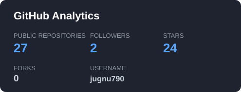
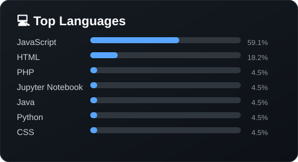
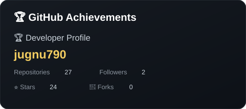

<div align="center">


<br>

<a href="https://github.com/jugnu790"></a>
&nbsp;
<a href="https://github.com/jugnu790?tab=followers"></a>
&nbsp;
<a href="https://github.com/jugnu790?tab=repositories"></a>

<br><br>

<a href="https://www.linkedin.com/in/deepesh-upadhyay-34bb3a169/"></a>
&nbsp;
<a href="mailto:deepeshupadhyay85@gmail.com"></a>
&nbsp;
<a href="https://leetcode.com/maradox/"></a>

</div>

---

# 👋 Hi, I'm Deepesh

<div align="center">

### Software Engineer @ NPCI Bharat BillPay Limited (NBBL)

**Backend • Full Stack • Microservices • DevOps • Cloud • AI**

🇮🇳 India

</div>

I am a **Software Engineer at NPCI Bharat BillPay Limited (NBBL)** since **October 2024**.

My primary focus is **Java, Spring Boot, REST APIs and microservices architecture**, with experience across enterprise applications, service integrations, messaging, databases, Dockerized environments and CI/CD workflows.

I also work with **React, Redux and JavaScript** and am currently expanding into **System Design, AWS, DevOps, AI and Generative AI**.

> 🤖 AI/GenAI tools below are presented as **learning/exploration tools**, not as claimed professional experience.

---

# 🧑‍💻 Developer Snapshot

<div align="center">

| | **Engineering Profile** | |
|:---:|:---|:---:|
| 🏢 | **Company** | NPCI Bharat BillPay Limited |
| 📅 | **Since** | October 2024 |
| 🎯 | **Primary Focus** | Java • Spring Boot • Microservices |
| ⚛️ | **Frontend** | React • Redux • JavaScript |
| 📨 | **Messaging** | Apache Kafka |
| ⚡ | **Caching** | Redis |
| 🗄️ | **Databases** | PostgreSQL • MySQL • Cassandra |
| 🔎 | **Observability** | Elasticsearch • Logstash • Kibana |
| 🐳 | **DevOps** | Docker • Jenkins • CI/CD |
| ☁️ | **Cloud** | AWS |
| 🐧 | **Environment** | Linux |
| 🧠 | **Problem Solving** | DSA • System Design |
| 🤖 | **Exploring** | AI • GenAI • LLMs • RAG |

</div>

---

# 💼 Professional Experience

## 🏦 NPCI Bharat BillPay Limited (NBBL)

**Software Engineer | October 2024 – Present**

Working on enterprise applications and microservices within the **Bharat Bill Payment ecosystem**.

| Area | Technologies / Focus |
|:---|:---|
| Backend | Java, Spring Boot, REST APIs |
| Architecture | Microservices, service integration |
| Messaging | Apache Kafka |
| Caching | Redis |
| Data | PostgreSQL, MySQL, Cassandra |
| DevOps | Docker, Jenkins, CI/CD |
| Environment | Linux, application troubleshooting |
| Operations | Debugging, production support, performance and reliability |

---

# 🔥 AMEX Utility

Worked on **AMEX Utility** and supporting backend services.

```text
                         ┌─────────────────┐
                         │   AMEX UTILITY   │
                         └────────┬────────┘
                                  │
                                  ▼
                         ┌─────────────────┐
                         │   SPRING BOOT   │
                         └────────┬────────┘
                                  │
                                  ▼
                         ┌─────────────────┐
                         │    REST APIs    │
                         └────────┬────────┘
                                  │
                    ┌─────────────┴─────────────┐
                    ▼                           ▼
             ┌─────────────┐             ┌─────────────┐
             │   DATABASE  │             │ MICROSERVICES│
             └──────┬──────┘             └──────┬──────┘
                    └─────────────┬──────────────┘
                                  ▼
                           ┌────────────┐
                           │   DOCKER   │
                           └─────┬──────┘
                                 ▼
                           ┌────────────┐
                           │ DEPLOYMENT │
                           └────────────┘
```

---

# 🔗 Short.io Microservices

Worked on **Short.io microservices** and related enterprise services.

| Engineering Area | Focus |
|:---|:---|
| Backend | Java • Spring Boot |
| APIs | REST API development |
| Architecture | Microservices |
| Integration | Service communication |
| Data | Database interaction |
| Infrastructure | Docker |
| Operations | Debugging • Configuration • Production support |

---

# ☕ Backend Engineering

<div align="center">

| Category | Technologies |
|:---|:---|
| Language | Java |
| Framework | Spring Boot |
| Security | Spring Security |
| Batch | Spring Batch |
| Integration | Spring Integration |
| Cloud Framework | Spring Cloud |
| Persistence | JPA • Hibernate |
| API | REST APIs |
| Architecture | Microservices • Clean Architecture |
| Engineering | Exception Handling • API Integration |

</div>

<p align="center">

</p>

---

# ⚛️ Full Stack Development

<div align="center">

| Layer | Technologies |
|:---|:---|
| UI | React.js |
| State | Redux |
| Language | JavaScript ES6+ |
| Markup | HTML5 |
| Styling | CSS3 |
| UI Frameworks | Tailwind CSS • Bootstrap |
| Integration | REST API Integration |
| Design | Responsive • Data-driven Interfaces |

</div>

<p align="center">

</p>

---

# 📨 Messaging & Distributed Systems

## Apache Kafka

```text
┌──────────┐       ┌─────────────┐       ┌──────────┐
│ PRODUCER │ ────► │ KAFKA TOPIC │ ────► │ CONSUMER │
└──────────┘       └─────────────┘       └────┬─────┘
                                              │
                                              ▼
                                       ┌─────────────┐
                                       │ MICROSERVICE│
                                       └──────┬──────┘
                                              ▼
                                       ┌─────────────┐
                                       │   PROCESS   │
                                       └──────┬──────┘
                                              ▼
                                       ┌─────────────┐
                                       │   DATABASE  │
                                       └─────────────┘
```

| Technology | Purpose |
|:---|:---|
| Kafka | Event-driven communication |
| Kafka | Asynchronous processing |
| Kafka | Producer / Consumer architecture |
| Kafka | Microservice communication |
| Redis | Caching |
| Redis | Fast data access |
| Redis | Performance optimization |

---

# 🗄️ Database & Data Technologies

<div align="center">

| Technology | Type | Focus |
|:---|:---|:---|
| PostgreSQL | SQL | Relational data |
| MySQL | SQL | Relational data |
| Cassandra | NoSQL | Distributed data |
| MongoDB | NoSQL | Document data |
| Redis | In-memory | Caching |
| Elasticsearch | Search | Search & analytics |

</div>

<p align="center">

</p>

---

# 🔎 Observability & Logging

```text
APPLICATION
     │
     ▼
SPRING BOOT
     │
     ▼
   LOGS
     │
     ▼
 LOGSTASH
     │
     ▼
ELASTICSEARCH
     │
     ▼
  KIBANA
     │
     ▼
OPERATIONAL INSIGHTS
```

| Tool | Role |
|:---|:---|
| Logstash | Log processing |
| Elasticsearch | Search / indexing |
| Kibana | Visualization / operational analysis |

---

# 🐳 DevOps & Cloud

<p align="center">

</p>

```text
DEVELOPER
   │
   ▼
  GIT
   │
   ▼
GITHUB / GITLAB
   │
   ▼
 JENKINS
   │
   ▼
 BUILD
   │
   ▼
 TEST
   │
   ▼
 DOCKER
   │
   ▼
CONTAINER
   │
   ▼
DEPLOYMENT
```

<div align="center">

| Area | Tools |
|:---|:---|
| Version Control | Git • GitHub • GitLab |
| CI/CD | Jenkins |
| Containers | Docker • Docker Compose |
| Cloud | AWS |
| OS | Linux |
| Web / Proxy | Nginx • Apache Tomcat |
| API Testing | Postman |
| IDE | IntelliJ IDEA • VS Code |
| Automation | Shell Scripting |

</div>

---

# 🤖 AI / GenAI Engineering Journey

### Currently Exploring — AI Tools + LLM Applications

The goal is to understand how modern AI capabilities can connect with **backend systems, APIs, data and enterprise applications**.

```text
                         🤖 AI ENGINEERING
                                │
             ┌──────────────────┼──────────────────┐
             ▼                  ▼                  ▼
           LLMs              AI APIs          AI Coding
             │                  │                  │
             ▼                  ▼                  ▼
        ┌──────────┐       ┌──────────┐       ┌──────────┐
        │   RAG    │       │ Agents   │       │ Copilot │
        └────┬─────┘       └────┬─────┘       └────┬─────┘
             └──────────────────┼──────────────────┘
                                ▼
                         Intelligent Apps
                                │
                                ▼
                     Enterprise AI Integration
```

## 🧠 AI Tools I'm Exploring

<div align="center">

| Tool / Platform | Category | Learning Focus |
|:---|:---|:---|
| OpenAI | LLM / AI APIs | LLM applications • AI APIs |
| Claude | LLM / AI Assistant | Reasoning • coding workflows |
| Gemini | LLM / AI Platform | Multimodal AI • APIs |
| GitHub Copilot | AI Coding | Code assistance • development |
| Cursor | AI IDE | AI-assisted software development |
| LangChain | AI Framework | LLM application pipelines |
| LangGraph | Agent Framework | Agent workflows |
| Hugging Face | AI / ML Platform | Models • datasets • ecosystem |
| Ollama | Local AI | Running local LLMs |
| Chroma | Vector Database | Embeddings • RAG |
| Pinecone | Vector Database | Vector search • RAG concepts |

</div>

<p align="center">

</p>

### 🎯 AI Learning Areas

`LLMs` • `Prompt Engineering` • `AI APIs` • `RAG` • `Embeddings` • `Vector Databases` • `AI Agents` • `LangChain` • `LangGraph` • `AI-assisted Development` • `Enterprise AI`

> **Important:** These AI technologies are part of my current learning and exploration journey. I do not present them as professional production experience unless explicitly stated.

---

# 🧩 Full Technology Matrix

<div align="center">

| Domain | Technologies |
|:---|:---|
| 💻 Languages | Java • JavaScript • SQL • Python *(AI learning)* |
| ☕ Backend | Spring Boot • Spring Security • Spring Batch • Spring Cloud |
| 🧩 Architecture | Microservices • REST • Clean Architecture |
| ⚛️ Frontend | React • Redux • HTML5 • CSS3 • Tailwind • Bootstrap |
| 📨 Messaging | Apache Kafka |
| ⚡ Cache | Redis |
| 🗄️ SQL | PostgreSQL • MySQL |
| 🗄️ NoSQL | Cassandra • MongoDB |
| 🔎 Search / Logs | Elasticsearch • Logstash • Kibana |
| 🐳 Containers | Docker • Docker Compose |
| 🔄 CI/CD | Jenkins |
| ☁️ Cloud | AWS |
| 🐧 OS | Linux |
| 🔧 Tools | Git • GitHub • GitLab • Postman • IntelliJ • VS Code |
| 🤖 AI / GenAI | OpenAI • Claude • Gemini • Copilot • Cursor |
| 🧠 AI Frameworks | LangChain • LangGraph |
| 🔬 AI Ecosystem | Hugging Face • Ollama |
| 📚 RAG / Vector | Chroma • Pinecone |
| 🧠 Fundamentals | DSA • System Design • Distributed Systems |

</div>

---

# 🏗️ Architecture Mindset

```text
                              CLIENT
                                │
                                ▼
                         ┌─────────────┐
                         │ API / GATEWAY│
                         └──────┬──────┘
                                │
            ┌───────────────────┼───────────────────┐
            ▼                   ▼                   ▼
       ┌──────────┐        ┌──────────┐        ┌──────────┐
       │ SERVICE A│        │ SERVICE B│        │ SERVICE C│
       └────┬─────┘        └────┬─────┘        └────┬─────┘
            └───────────────────┼───────────────────┘
                                ▼
                         ┌─────────────┐
                         │ APACHE KAFKA│
                         └──────┬──────┘
                                │
             ┌──────────────────┼──────────────────┐
             ▼                  ▼                  ▼
        PostgreSQL            Redis            Cassandra
             │                                      │
             └──────────────────┬───────────────────┘
                                ▼
                         Elasticsearch
                                │
                                ▼
                             Kibana
```

### Engineering Priorities

| Priority | Goal |
|:---|:---|
| ⚡ Performance | Fast and efficient systems |
| 📈 Scalability | Handle growing workloads |
| 🧩 Maintainability | Clean and understandable code |
| 🔒 Security | Secure APIs and applications |
| 🔍 Observability | Logs, metrics and diagnostics |
| 🛡️ Reliability | Stable production systems |
| 🔄 Automation | Repeatable engineering workflows |
| 🚀 Production Readiness | Software that works beyond local development |

---

# 🛠️ Technology Stack

<p align="center">

</p>

---

## 📊 GitHub Analytics

<div align="center">




</div>

---

## 🐍 Contribution Snake

<p align="center">
<picture>
<source media="(prefers-color-scheme: dark)" srcset="https://raw.githubusercontent.com/jugnu790/jugnu790/output/github-contribution-grid-snake-dark.svg">
<source media="(prefers-color-scheme: light)" srcset="https://raw.githubusercontent.com/jugnu790/jugnu790/output/github-contribution-grid-snake.svg">

</picture>
</p>

---

## 🏆 GitHub Trophies

<div align="center">

</div>

> The Snake requires the `.github/workflows/snake.yml` GitHub Action to generate the SVG.

---

# 🏆 GitHub Trophies

<p align="center">

</p>

---

# 🧠 Problem Solving

<div align="center">

| Platform | Focus |
|:---|:---|
| LeetCode | DSA • Algorithms • Problem Solving |
| GeeksforGeeks | DSA • CS Fundamentals |
| GitHub | Projects • Engineering Practice |

<br>

<a href="https://leetcode.com/maradox/"></a>
&nbsp;
<a href="https://www.geeksforgeeks.org/"></a>

</div>

---

# 🚀 Project Development Flow

```text
                         💡 IDEA
                           │
                           ▼
                     🧩 ARCHITECTURE
                           │
                           ▼
                        ☕ BACKEND
                           │
                           ▼
                       ⚛️ FRONTEND
                           │
                           ▼
                     🔗 INTEGRATION
                           │
                           ▼
                      🗄️ DATABASE
                           │
                           ▼
                       🧪 TESTING
                           │
                           ▼
                       🐳 DOCKER
                           │
                           ▼
                       🔄 CI / CD
                           │
                           ▼
                       🚀 DEPLOY
                           │
                           ▼
                     🔍 MONITOR
```

---

# 🎯 Current Learning

<div align="center">

| Track | Current Focus |
|:---|:---|
| 🧠 DSA | Algorithms • Data Structures • Problem Solving |
| ☕ Java | Core & Advanced Java |
| 🌱 Spring | Spring Boot • Spring Cloud |
| 🧩 System Design | Distributed Systems |
| 📨 Kafka | Event-driven Architecture |
| 🐳 DevOps | Docker • Jenkins • Kubernetes |
| ☁️ AWS | Cloud Engineering |
| 🔐 Security | Secure Application Development |
| ⚛️ React | Production-grade Frontend |
| 🤖 AI | LLMs • RAG • AI APIs • Agents |
| 🧠 GenAI | LangChain • LangGraph • Vector Search |
| 🌎 Open Source | Meaningful Contributions |

</div>

---

# 🎯 2026 Goals

<div align="center">

| Area | 2026 Goal | Status |
|:---|:---|:---:|
| 🧠 DSA | Advanced Problem Solving | 🔄 |
| ☕ Java | Core & Advanced Java | 🔄 |
| 🌱 Spring | Advanced Spring Boot / Cloud | 🔄 |
| 🧩 System Design | Distributed Systems | 🔄 |
| 📨 Kafka | Event-driven Architecture | 🔄 |
| 🐳 DevOps | Docker / Jenkins / Kubernetes | 🔄 |
| ☁️ AWS | Cloud Engineering | 🔄 |
| 🔐 Security | Secure Application Development | 🔄 |
| ⚛️ React | Production-grade Frontend | 🔄 |
| 🤖 AI | Generative AI & AI Engineering | 🔄 |
| 🧠 Agents | LangChain / LangGraph | 🔄 |
| 🌎 Open Source | Meaningful Contributions | 🔄 |

</div>

---

# 🖥️ Developer Terminal

```text
╭──────────────────────────────────────────────────────────────╮
│  DEEPESH@DEVELOPER ~ $                                      │
├──────────────────────────────────────────────────────────────┤
│                                                              │
│  $ whoami                                                    │
│  Deepesh Upadhyay                                            │
│                                                              │
│  $ role                                                      │
│  Software Engineer                                           │
│                                                              │
│  $ company                                                   │
│  NPCI Bharat BillPay Limited                                │
│                                                              │
│  $ since                                                      │
│  October 2024                                                │
│                                                              │
│  $ primary-stack                                              │
│  Java + Spring Boot + Microservices                          │
│                                                              │
│  $ frontend                                                   │
│  React + Redux + JavaScript                                  │
│                                                              │
│  $ infrastructure                                             │
│  Docker + Jenkins + AWS + Linux                              │
│                                                              │
│  $ messaging                                                  │
│  Kafka + Redis                                                │
│                                                              │
│  $ databases                                                  │
│  PostgreSQL + MySQL + Cassandra                              │
│                                                              │
│  $ ai-learning                                                │
│  LLMs + RAG + AI APIs + Agents                              │
│                                                              │
│  $ status                                                     │
│  ● ONLINE                                                     │
│                                                              │
╰──────────────────────────────────────────────────────────────╯
```

---

# 💡 Engineering Philosophy

### `Learn → Build → Break → Debug → Understand → Improve`

```text
Requirement
    │
    ▼
Understand
    │
    ▼
Design
    │
    ▼
Build
    │
    ▼
Test
    │
    ▼
Debug
    │
    ▼
Deploy
    │
    ▼
Monitor
    │
    ▼
Improve
    │
    └──────────────► Repeat
```

> **Good software isn't just code that works. It should be understandable, maintainable, testable and reliable in production.**

---

# ⚡ Fun Fact

```text
🐛 One of the most famous early computer bugs involved
   an actual moth found inside the Harvard Mark II.

💻 So sometimes...

                  THE BUG REALLY IS A BUG. 🐛
```

---

# 🌐 Connect With Me

<div align="center">

<a href="https://github.com/jugnu790"></a>
&nbsp;
<a href="https://www.linkedin.com/in/deepesh-upadhyay-34bb3a169/"></a>
&nbsp;
<a href="https://leetcode.com/maradox/"></a>

<br><br>

<a href="mailto:deepeshupadhyay85@gmail.com"></a>

</div>

---

<div align="center">

### 💻 Code. 🚀 Build. 🧠 Learn. 🤖 Explore. 🔧 Improve.


</div>
