


 

 

  

## 👨‍💻 Who's typing

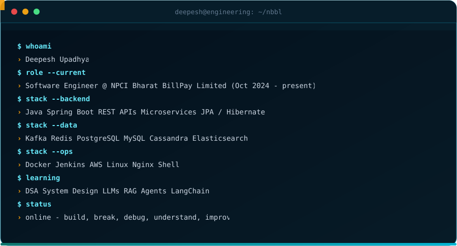

I am a **Software Engineer at NPCI Bharat BillPay Limited (NBBL)**, working primarily on backend systems using **Java, Spring Boot, REST APIs and microservices**.

My work involves designing and integrating services, asynchronous communication through **Apache Kafka**, data management using **PostgreSQL, MySQL and Cassandra**, caching with **Redis**, and containerised deployments using **Docker and Jenkins**.

My day-to-day work includes:

- Backend API development
- Microservice integration
- Kafka-based asynchronous workflows
- Database integration
- Production debugging
- Performance and reliability improvements
- CI/CD and deployment support
- Troubleshooting distributed-service behaviour

I also work with **React, Redux and JavaScript** and am currently going deeper into **System Design, AWS, DevOps and AI/GenAI**.

> AI and GenAI technologies listed below are part of my **learning journey** and are not presented as production experience.

## 🏗️ What the systems look like

A simplified representation of the type of backend architecture I work with — requests enter through APIs, services communicate through events, state is stored across databases and caches, and applications are delivered through CI/CD pipelines.

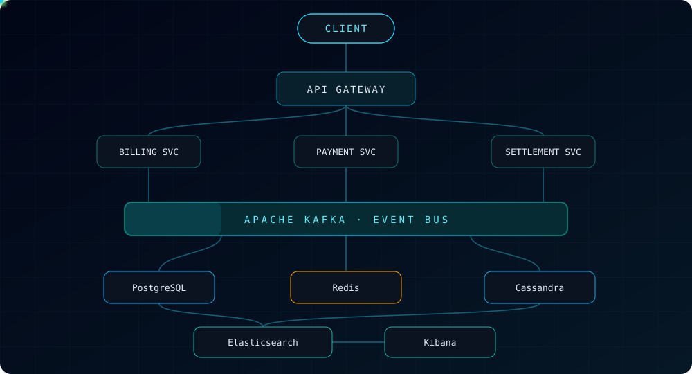

### ⚡ Events instead of tight coupling

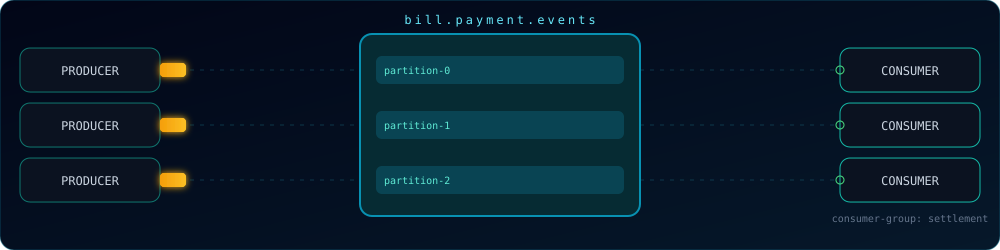

### 🚀 From commit to deployment

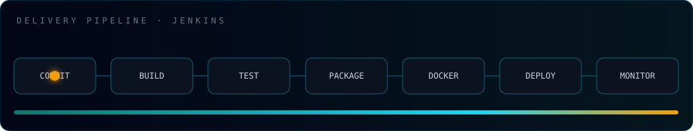

## 🛠️ The stack


  

 

 


<b>Full technology matrix</b>

 

| Domain | Technologies |
|:---|:---|
| Languages | Java · JavaScript · SQL · Python *(learning)* |
| Backend | Spring Boot · Spring Security · Spring Batch · Spring Cloud · JPA · Hibernate |
| Architecture | Microservices · REST · Clean Architecture |
| Frontend | React · Redux · HTML5 · CSS3 · Tailwind · Bootstrap |
| Messaging | Apache Kafka |
| Cache | Redis |
| SQL | PostgreSQL · MySQL |
| NoSQL | Cassandra · MongoDB |
| Search & Logs | Elasticsearch · Logstash · Kibana |
| Containers & CI/CD | Docker · Docker Compose · Jenkins |
| Cloud & OS | AWS · Linux · Nginx · Tomcat |
| Development Tools | Git · GitHub · GitLab · Postman · IntelliJ IDEA · VS Code |
| AI / GenAI *(learning)* | OpenAI · Claude · Gemini · Copilot · Cursor · LangChain · LangGraph · Hugging Face · Ollama · Chroma · Pinecone |
| Fundamentals | DSA · System Design · Distributed Systems |

## 💼 Work

### Software Engineer — NPCI Bharat BillPay Limited

**October 2024 – Present**

| Area | Experience |
|:---|:---|
| Backend | Java, Spring Boot, REST API development and integration |
| Architecture | Microservices and service-to-service communication |
| Messaging | Apache Kafka producers and consumers |
| Databases | PostgreSQL, MySQL and Cassandra |
| Caching | Redis |
| Delivery | Docker, Jenkins and Linux environments |
| Operations | Debugging, production support, performance and reliability |
| Frontend | React, Redux and JavaScript |

Projects I have contributed to include **AMEX Utility** and **Short.io microservices**, along with supporting backend services around them.

## 📊 GitHub activity

The profile statistics and visual cards below are generated by workflows in this repository using GitHub data.



  


## 🔄 How I work


Good software is not just code that runs.

It should be:

- Understandable six months later
- Debuggable when something breaks
- Observable in production
- Reliable under failure
- Simple enough to maintain
- Honest about its limitations

I care more about **performance, observability and reliability** than clever abstractions.

## 📚 What I'm learning in 2026

| Track | Focus | Status |
|:---|:---|:---:|
| DSA | Advanced problem solving on LeetCode & GeeksforGeeks | 🔄 |
| System Design | Distributed systems and scalability patterns | 🔄 |
| Kafka | Event-driven architecture in depth | 🔄 |
| DevOps | Docker, Jenkins and Kubernetes | 🔄 |
| AWS | Cloud engineering fundamentals | 🔄 |
| Security | Secure application development | 🔄 |
| React | Production-grade frontend development | 🔄 |
| AI / GenAI | LLMs, RAG, embeddings, agents, LangChain and LangGraph | 🔄 |
| Open Source | Meaningful open-source contributions | 🔄 |

## 🐛 Fun fact

The first recorded computer bug was a literal bug — a moth was found inside the Harvard Mark II computer in 1947 and taped into the logbook.

Sometimes the bug really is a bug. 🐛

  

<!-- AUTO-GENERATED-START -->

## 📊 Live GitHub Statistics

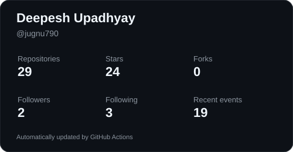

| Metric | Value |
|---|---:|
| Repositories | 27 |
| Stars | 24 |
| Forks | 0 |
| Followers | 2 |
| Following | 3 |

---

## 🐍 Contribution Snake

---

## 💻 Languages

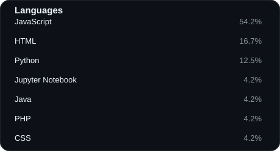

---

## 🚀 Top Repositories

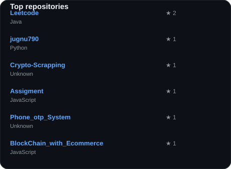

---

### 🔄 Last automated update

`2026-08-25 16:36 UTC`

<!-- AUTO-GENERATED-END -->

