 

## Who's typing

I build backend services in the **Bharat Bill Payment** ecosystem — Java and Spring Boot, REST APIs, microservices that talk over Kafka, data in PostgreSQL, MySQL and Cassandra, everything containerised and shipped through Jenkins. Most of my week is API design, integration work, debugging production behaviour, and making services boring in the way production wants them to be.

On the side I work with **React, Redux and JavaScript**, and I'm currently going deeper on **System Design, AWS, DevOps and AI/GenAI**.

> AI and GenAI tools listed further down are part of my **learning journey** — I don't present them as production experience.

## What the systems look like

A simplified view of the shape of work I do daily — request in, events on the bus, state in the stores, logs in the stack.

### Events, not tight coupling

### From commit to monitored

## The stack, in orbit

 

 

 

<b>Full technology matrix</b>

 

| Domain | Technologies |
|:---|:---|
| Languages | Java · JavaScript · SQL · Python *(learning)* |
| Backend | Spring Boot · Spring Security · Spring Batch · Spring Cloud · JPA · Hibernate |
| Architecture | Microservices · REST · Clean Architecture |
| Frontend | React · Redux · HTML5 · CSS3 · Tailwind · Bootstrap |
| Messaging | Apache Kafka |
| Cache | Redis |
| SQL | PostgreSQL · MySQL |
| NoSQL | Cassandra · MongoDB |
| Search & logs | Elasticsearch · Logstash · Kibana |
| Containers & CI | Docker · Docker Compose · Jenkins |
| Cloud & OS | AWS · Linux · Nginx · Tomcat |
| Tools | Git · GitHub · GitLab · Postman · IntelliJ IDEA · VS Code |
| AI / GenAI *(learning)* | OpenAI · Claude · Gemini · Copilot · Cursor · LangChain · LangGraph · Hugging Face · Ollama · Chroma · Pinecone |
| Fundamentals | DSA · System Design · Distributed Systems |

## Work

**Software Engineer · NPCI Bharat BillPay Limited (NBBL) · October 2024 – present**

| Area | What that means day to day |
|:---|:---|
| Backend | Java, Spring Boot, REST API design and integration |
| Architecture | Microservices, service-to-service communication |
| Messaging | Kafka producers and consumers for async workflows |
| Data | PostgreSQL, MySQL, Cassandra, Redis caching |
| Delivery | Docker images, Jenkins pipelines, Linux environments |
| Operations | Debugging, production support, performance and reliability |

Projects I've contributed to include **AMEX Utility** and **Short.io microservices**, plus the supporting backend services around them.

## GitHub activity

These four cards are generated from the GitHub API by a workflow in this repo — no third-party rendering service, so they can't rate-limit or go grey.

  

  

  

<picture>
  <source media="(prefers-color-scheme: dark)" srcset="https://raw.githubusercontent.com/jugnu790/jugnu790/output/github-contribution-grid-snake-dark.svg"/>
  <source media="(prefers-color-scheme: light)" srcset="https://raw.githubusercontent.com/jugnu790/jugnu790/output/github-contribution-grid-snake.svg"/>
  
</picture>

## How I work

Good software isn't just code that runs. It should be understandable six months later, debuggable at 2am, and honest about its failure modes. I care about performance, observability and reliability more than clever abstractions.

## What I'm learning in 2026

| Track | Focus | Status |
|:---|:---|:---:|
| DSA | Advanced problem solving on LeetCode & GFG | 🔄 |
| System Design | Distributed systems, scaling patterns | 🔄 |
| Kafka | Event-driven architecture in depth | 🔄 |
| DevOps | Docker, Jenkins, Kubernetes | 🔄 |
| AWS | Cloud engineering fundamentals | 🔄 |
| Security | Secure application development | 🔄 |
| React | Production-grade frontend | 🔄 |
| AI / GenAI | LLMs, RAG, embeddings, agents, LangChain / LangGraph | 🔄 |
| Open source | Meaningful contributions | 🔄 |

## Fun fact

The first computer "bug" was a literal one — a moth pulled out of the Harvard Mark II in 1947 and taped into the logbook. Sometimes the bug really is a bug. 🐛

<!-- AUTO-GENERATED-START -->

## 📊 Live GitHub Statistics

| Metric | Value |
|---|---:|
| Repositories | 27 |
| Stars | 24 |
| Forks | 0 |
| Followers | 2 |
| Following | 3 |

---

## 🐍 Contribution Snake

---

## 💻 Languages

---

## 🚀 Top Repositories

---

### 🔄 Last automated update

`2026-08-16 04:35 UTC`

<!-- AUTO-GENERATED-END -->

